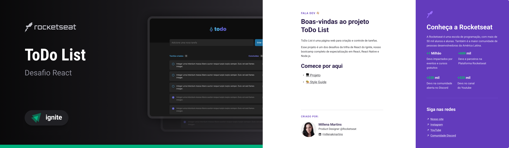

# ToDo List
Minha resolução ao primeiro desafio da trilha ReactJS do Ignite da empresa @Rocketseat. O projeto tem como objetivo botar em pratica os conceitos inicias de React com um projeto de controle de tarefas estilo to-do list. :rocket:<br><br>



## 🚀 Tecnologias
- ✔️ ReactJS - Biblioteca Javascript
- ✔️ Typescript - Superset do Javascript
- ✔️ Phosphor Icons - Biblioteca de ícones
- ✔️ Vite - Bundler e dev-server

## 📦️ Pré-Requisitos
Antes de começar você vai precisar ter instalado na sua máquina as ferramentas [Git](https://git-scm.com/) e [Node](https://nodejs.org/en/download/).

## ⚡ Executando o projeto
1. Clone o repositório
```
    git clone https://github.com/DouglasLacerdaC/IgniteToDoList.git
```
2. Acesse a pasta do projeto e instale as dependências
```
    npm install
```
3. Execute o projeto
```
    npm run dev
```
4. Acesse pelo navegador
```
    http://127.0.0.1:5173/
```

Desenvolvido por [Douglas Lacerda](https://www.linkedin.com/in/douglas-lacerda-da-conceicao/)